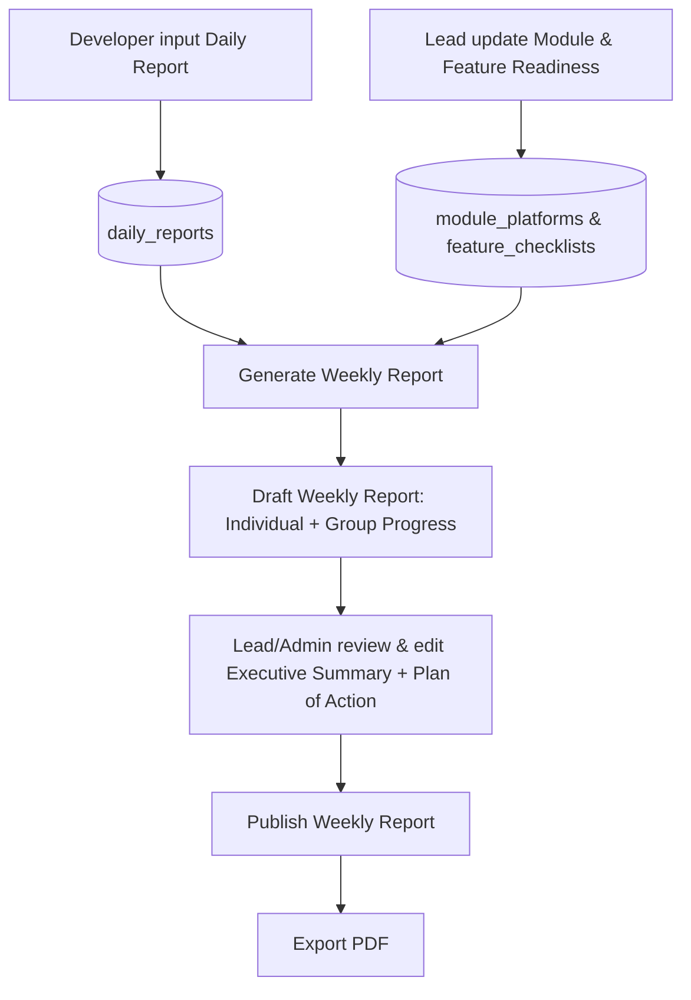

# 📊 Development Report Management System

Sistem manajemen laporan development berbasis **Laravel + Filament** untuk mengelola *individual report* (harian) dan *group/weekly report* dari seluruh anggota tim development, lengkap dengan agregasi otomatis dan export PDF.

Dibangun untuk menggantikan proses rekap laporan mingguan yang tadinya manual (copy-paste dari chat/dokumen) menjadi satu sistem terpusat.

---

## ✨ Fitur

- **Individual Report (Daily)** — Setiap developer input progress/task/hasil harian sendiri.
- **Group Report (Weekly)** — Progress dikelompokkan otomatis ke dalam 3 kategori:
  - 🟢 **Ongoing Module** — progress % per platform + feature readiness checklist
  - 🔵 **Completed Module** — status testing & bug fixing
  - ⚪ **General** — task ad-hoc di luar modul spesifik
- **Feature Readiness Tracking** — checklist fitur per platform (✅ Done / 🔄 In Progress / ⬜ Belum) yang bisa diupdate langsung dari tabel.
- **Auto-Generate Weekly Report** — satu klik untuk menarik semua daily report dalam rentang tanggal tertentu dan menyusunnya jadi ringkasan per developer.
- **Export PDF** — hasil akhir laporan mingguan bisa di-export ke PDF dengan format konsisten (Report Description → Executive Summary → Progress → Plan of Actions → Individual Reports).
- **Role-based Access** — Developer hanya melihat report miliknya sendiri, Lead/Admin melihat semua.

---

## 🖥️ Tech Stack

| Komponen | Teknologi |
|---|---|
| Backend | [Laravel](https://laravel.com) |
| Admin Panel | [Filament v3](https://filamentphp.com) |
| PDF Export | [barryvdh/laravel-dompdf](https://github.com/barryvdh/laravel-dompdf) |
| Database | MySQL / PostgreSQL / SQLite |

---

## 📁 Struktur Modul

```
app/
├── Models/
│   ├── Team.php
│   ├── Project.php
│   ├── Module.php
│   ├── ModulePlatform.php
│   ├── FeatureChecklist.php
│   ├── DailyReport.php
│   ├── WeeklyReport.php
│   └── WeeklyReportIndividualSummary.php
├── Services/
│   └── WeeklyReportAggregatorService.php   # logic agregasi daily -> weekly report
└── Filament/Resources/
    ├── TeamResource.php
    ├── ProjectResource.php
    ├── ModuleResource.php                  # + RelationManager Platforms & Feature Readiness
    ├── DailyReportResource.php
    └── WeeklyReportResource.php             # + Generate Draft & Export PDF actions

database/migrations/    # 9 migration
resources/views/pdf/    # template PDF weekly report
```

### Alur Data



---

## 🚀 Instalasi

### Opsi A — Project Laravel baru

```bash
# 1. Clone repository
git clone https://github.com/<username>/<repo-name>.git
cd <repo-name>

# 2. Install dependencies
composer install
npm install && npm run build

# 3. Setup environment
cp .env.example .env
php artisan key:generate

# 4. Konfigurasi database di .env, lalu migrate + seed
php artisan migrate --seed

# 5. Link storage untuk local disk
php artisan storage:link

# 6. Buat user admin pertama
php artisan make:filament-user

# 7. Jalankan
php artisan serve
```

Akses panel admin di `http://localhost:8000/admin`.

### Storage GCP

Untuk simpan upload daily report dan PDF export ke Google Cloud Storage, set `.env` seperti ini:

```env
FILESYSTEM_PUBLIC_DISK=gcs
GOOGLE_CLOUD_PROJECT_ID=your-gcp-project-id
GOOGLE_CLOUD_STORAGE_BUCKET=your-bucket-name
GOOGLE_CLOUD_KEY_FILE=/absolute/path/to/service-account.json
GOOGLE_CLOUD_STORAGE_VISIBILITY=public
```

Jika credentials disediakan oleh runtime GCP, `GOOGLE_CLOUD_KEY_FILE` bisa dikosongkan. Jika bucket memakai CDN/custom domain, isi `GOOGLE_CLOUD_STORAGE_URL`.

Dengan GCS, `php artisan storage:link` tidak diperlukan untuk file upload/export.

### Opsi B — Tanam ke project Laravel + Filament yang sudah ada

1. Copy folder `app/`, `database/`, `resources/` ke root project kamu (merge, jangan timpa file yang sudah ada — terutama `app/Models/User.php`).
2. Update `app/Models/User.php` sesuai instruksi di `app/Models/User_ADDITIONS.md`.
3. Pastikan package berikut ter-install:
   ```bash
   composer require filament/filament:"^3.0"
   composer require barryvdh/laravel-dompdf
   ```
4. Jalankan:
   ```bash
   php artisan migrate
   php artisan db:seed --class=Database\\Seeders\\ReportSystemSeeder
   php artisan storage:link # hanya jika pakai FILESYSTEM_PUBLIC_DISK=public
   ```

---

## 📖 Cara Pakai

1. **Developer** login → menu **Individual Report** → isi progress harian (tanggal, modul opsional, progress/task/hasil).
2. **Lead/Admin** kelola menu **Modules** → tambah modul, tentukan kategori (Ongoing / Completed / General), tambah platform beserta persentase progress, lalu kelola **Feature Readiness** checklist per platform.
3. Buka menu **Weekly / Group Report** → buat report baru (project, no. report, periode, topic, executive summary, plan of actions).
4. Klik **Generate Draft** → sistem otomatis menyusun ringkasan individual report dari seluruh daily report pada periode tersebut.
5. Review/edit ringkasan bila perlu di tab **Individual Reports**.
6. Klik **Export PDF** untuk menghasilkan dokumen laporan mingguan yang siap dibagikan.

---

## 🗺️ Roadmap

- [ ] Dashboard widget (chart progress per modul, compliance tracking siapa yang belum isi daily report)
- [ ] Notifikasi reminder (email/WhatsApp) untuk daily report yang belum diisi
- [ ] Export ke Word (.docx) selain PDF
- [ ] Role & permission lebih granular (integrasi `spatie/laravel-permission`)
- [ ] Kolom `project_id` langsung di `daily_reports` untuk isolasi general task multi-project

---

## 🤝 Contributing

Pull request terbuka untuk perbaikan bug, fitur baru, atau perbaikan dokumentasi. Untuk perubahan besar, buka issue terlebih dahulu untuk didiskusikan.

---

## 📄 License

[MIT](LICENSE)
